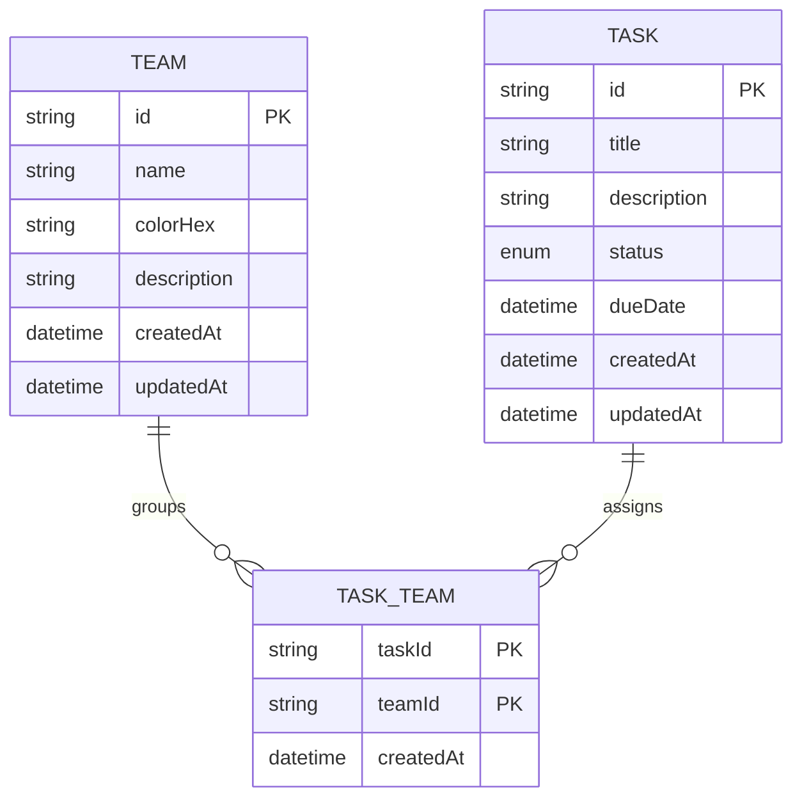

# Claro

Este repositório está dividido em duas aplicações:

- [`front/`](./front) - cliente mobile em Expo/React Native. Veja [`front/README.md`](./front/README.md).
- [`back/`](./back) - API REST em Node.js/Express com Prisma + MySQL. Veja [`back/README.md`](./back/README.md).

Use os READMEs específicos de cada aplicação para detalhes de instalação e execução. Este README da raiz é a visão geral de entrega: estrutura, arquitetura e modelo de dados.

## Estrutura do Repositório

```text
.
├── back/   # API REST, schema do Prisma, Docker Compose e testes
├── front/  # App Expo, telas, hooks, repositories e testes
```

## Resumo da Arquitetura

- `front/` consome o backend por meio de adapters HTTP na camada de repositories e expõe os dados para as telas por hooks com React Query.
- `back/` expõe `/api/teams` e `/api/tasks`, valida entrada com Zod e persiste os dados com Prisma.
- Times e tarefas são modelados como um relacionamento muitos-para-muitos por meio da tabela de junção `TaskTeam`, então uma tarefa pode pertencer a vários times e um time pode ter várias tarefas.

## Decisões Arquiteturais

### Por que o repositório está dividido em `front/` e `back/`

O código mantém o cliente mobile e a API independentes para que cada lado possa evoluir, rodar e ser testado separadamente, mesmo compartilhando um domínio simples: times e tarefas. Essa separação deixa a entrega mais prática para desenvolvimento local e também mais fácil de explicar para a próxima pessoa que for manter o projeto.

### Por que o MySQL foi escolhido

O MySQL faz sentido aqui por ser uma escolha pragmática e simples para o contexto do teste:

- O Prisma oferece suporte limpo a ele, com pouca configuração de infraestrutura.
- O backend já tem um fluxo único com `docker compose`, então qualquer pessoa consegue subir o banco localmente sem provisionamento extra.
- O mapeamento da porta `3307` no host evita conflitos comuns com instalações locais de MySQL já existentes.
- Para esse domínio, um banco relacional é a forma mais direta de modelar times, tarefas e a tabela de junção entre eles sem aumentar a complexidade operacional.

Em resumo: o MySQL foi escolhido por simplicidade, previsibilidade e facilidade de uso no ambiente local.

### Como as entidades e os relacionamentos foram modelados

O domínio está centrado em três modelos principais no banco:

- `Team`: `id`, `name`, `colorHex`, `description` opcional e timestamps.
- `Task`: `id`, `title`, `description` opcional, `status`, `dueDate` opcional e timestamps.
- `TaskTeam`: tabela de junção com chave primária composta por `taskId + teamId`.

Em termos de comportamento:

- Uma tarefa pode estar ligada a zero, um ou vários times por meio de `teamIds`.
- A listagem de tarefas pode ser filtrada por `teamId`, `status` e `search`, além de ordenada por `title`, `dueDate` ou `status`.
- Ao excluir um time, os vínculos são removidos primeiro, mas as tarefas são preservadas.
- Ao excluir uma tarefa, a própria tarefa é removida e as linhas em `TaskTeam` são limpas pelas regras de cascade do relacionamento.

### Organização em camadas do backend

O backend segue uma separação simples por responsabilidade:

1. `routes/` define os endpoints HTTP.
2. `schema/` define os contratos com Zod para params, query strings e bodies.
3. o middleware `validate` aplica esses contratos antes da regra de negócio.
4. `controller/` traduz `request` e `response` do Express para chamadas de serviço.
5. `service/` concentra a regra de negócio e as consultas com Prisma.
6. `mapper/` transforma os modelos do Prisma no shape de resposta da API.

Isso mantém as responsabilidades separadas sem introduzir abstrações desnecessárias para uma API CRUD pequena.

### Por que essas bibliotecas foram escolhidas no frontend

- `@tanstack/react-query`: o estado de servidor é central no app, então cache, invalidação de query e refetch automático reduzem bastante o trabalho manual.
- `react-hook-form`: fluxos com bastante formulário, como criação e edição de times e tarefas, ficam mais leves e organizados com controle de estado eficiente e suporte a `Controller` no React Native.
- `zod`: o frontend usa validação baseada em schema nos formulários, e o backend usa Zod para validar requests, o que ajuda a manter regras consistentes entre as duas camadas.
- `nativewind`: a abordagem utility-first deixa a construção das telas mais rápida e fácil de manter, principalmente em padrões repetidos de espaçamento, cores e layout.

## Modelo de Dados



## Onde continuar

- Setup do frontend, comandos do Expo e resolução da URL da API: [`front/README.md`](./front/README.md)
- Setup do backend, Docker, Prisma, formato da API e exemplos de CRUD: [`back/README.md`](./back/README.md)
